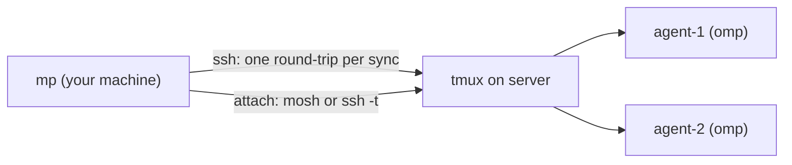

<div align="center">

# ◆ moshpit

**Keep your coding agents running on remote servers, through dropped connections, laptop sleep, and reboots.**

[](https://github.com/BlackFueg/moshpit/releases/latest)
[](LICENSE)
[](go.mod)


[Install](#install) · [Quick start](#quick-start) · [Command line](#command-line) · [How it works](#how-it-works) · [FAQ](#faq)

</div>

```
 ◆ MOSHPIT   agent sessions · tmux + mosh                               ✓ synced 14:02:11
╭─ Hosts 2 ─────────────────╮╭─ vps1 · root@203.0.113.7 · mosh (auto) ──────────────────╮
│▌● vps1                  2 ││   SESSION         STATE      WIN ACTIVE RUNNING  DIR      │
│▌  root@203.0.113.7 · mosh ││▌◆ api-refactor    ● attached 1   now    omp      ~/api    │
│ ● gpu-box               1 ││ ◇ scratch         ○ detached 2   4m     bash     /tmp     │
│   ubuntu@gpu.example · ssh││ ◆ docs            ✕ gone     —   —      omp      ~/docs   │
╰───────────────────────────╯╰──────────────────────────────────────────────────────────╯
 • Synced · vps1: rebooted, 1 session lost
 ↑↓ select  ⏎ attach  n new  r rename  x kill  ← hosts  s sync  ? help  q quit
```

Running an agent such as omp, Claude Code, or aider over plain SSH means a flaky
connection kills the run. **moshpit** (`mp`) runs every agent inside a
**tmux** session on the server, reconnects over **mosh** (or ssh), and gives
you one small TUI to manage all of it across all your machines.

## Features

- **Survives disconnects.** Agents live in tmux on the server and keep working while you're offline. You reattach with one keypress.
- **Zero-setup servers.** A fresh Linux VPS only needs `sshd`. Give moshpit an IP, user, and password once and it:
  - installs its own SSH key;
  - installs tmux and mosh with whatever package manager the server has, using sudo when you aren't root;
  - opens mosh's UDP ports if a local firewall is active;
  - writes a TUI-friendly `~/.tmux.conf`;
  - checks that key-only login works.
- **Stays in sync.** When it opens, and whenever you press `s`, moshpit compares its session list with each server:
  - finds sessions started by hand or from another machine;
  - detects reboots;
  - keeps sessions lost to a reboot listed so you can recreate them with one key.
- **No background noise.** It never polls. The network is only used when you open it or act.
- **Scriptable.** `mp work` reattaches from any shell. `mp vps1 work` creates the session on `vps1` and attaches.
- **Plays well with your setup.** It adds `ssh <name>` and `mosh <name>` aliases through a single `Include` line and never touches your existing hosts.
- **Themed.** Comes with tokyo-night, catppuccin, gruvbox, nord, and rose-pine. It's a single ~4 MB static binary.

## Install

**Prebuilt binary** (macOS and Linux, arm64 and x86_64):

```sh
curl -fsSL https://raw.githubusercontent.com/BlackFueg/moshpit/main/install.sh | sh
```

The script installs `mp` to `~/.local/bin` and verifies the download's SHA-256.
It also warns about anything missing locally (PATH, OpenSSH version, mosh).
Pin a version with `MOSHPIT_VERSION=v0.1.0`, or change the location with `PREFIX=/usr/local`.

**With Go** (1.24+):

```sh
go install github.com/BlackFueg/moshpit@latest     # installs as `moshpit`
ln -s "$(go env GOPATH)/bin/moshpit" ~/.local/bin/mp   # optional: the short name
```

**From source**:

```sh
git clone https://github.com/BlackFueg/moshpit.git && cd moshpit
make install                               # → ~/.local/bin/mp
```

### Requirements

| | Needs |
|---|---|
| **Your machine** | macOS or Linux, plus the OpenSSH client **8.4+** (`ssh`, `ssh-keygen`). Both come with macOS 12+ and any recent distro. |
| | *Optional:* **mosh** (`brew install mosh` / `apt install mosh`) for connections that survive network changes and sleep. Without it, moshpit uses ssh. |
| **Your servers** | Linux with `sshd`. For the automatic tmux/mosh install you need root or sudo the first time; otherwise install `tmux` yourself. |
| | For mosh: UDP **60000–61000** must be reachable. moshpit opens it in ufw and firewalld; cloud firewalls (AWS, Hetzner, GCP…) you open yourself. |

Windows isn't supported natively. Use WSL.

## Quick start

```sh
mp                 # open the TUI
```

1. Press **`a`** and enter the server's IP, the user, and the password. moshpit sets the server up and shows each step. The password is used once and never stored.
2. Press **`n`** to start a session. It opens in `~` and runs `omp` by default; you can change both in the form. You're attached right away.
3. Press **`ctrl-b d`** to detach. The agent keeps running. You're back in the list.
4. Close your laptop, change networks, come back later: **`⏎`** reattaches.

## Command line

```sh
mp                       # TUI
mp <session>             # reattach to <session> on whichever host has it
mp <host> <session>      # attach to <session> on <host>, creating it if needed
mp -version
```

- `mp <session>` checks the local registry first. If the session isn't there, it asks your hosts, so it finds sessions started from another machine.
- If a name exists on more than one host, it tells you which `mp <host> <session>` to run.
- New sessions start in `~` running `default_command`.
- Sessions lost to a reboot are recreated with their old directory and command.

### TUI keys

| Key | Action |
|---|---|
| `⏎` | Attach, or recreate a session that's gone |
| `n` | New session (name, directory, command) |
| `r` | Rename a session, or a host when the Hosts pane is focused |
| `x` | Kill a session · forget a gone one · remove a host (optionally revoking the key) |
| `a` | Add a host |
| `t` | Transport per host: `auto` → `mosh` → `ssh` (auto uses mosh when both ends have it) |
| `s` | Sync all hosts now |
| `T` | Cycle theme |
| `←` `→` `⇥` `↑` `↓` / `hjkl` | Navigate |
| `?` | Help |

`◆` marks sessions created with moshpit. `◇` marks sessions found on the server that were started by hand or from another machine.

## How it works



**Sync.** moshpit syncs when it opens, when you press `s`, and once after
each action you take (attach/detach, new, rename, kill). There's no timer and
no idle connection. Each sync is one ssh command per host that reads the tmux
sessions and the kernel boot ID, then compares them with the local registry:

| On the server | Result in moshpit |
|---|---|
| A session the registry doesn't know | Adopted, shown as `◇` |
| Boot ID changed (the server rebooted) | Reported; lost sessions stay as `✕ gone`. Press `⏎` to recreate one with the same directory and command, or `x` to forget it. |
| A session created with moshpit ended | Kept as `gone` so you can recreate it |
| An adopted session ended | Dropped |

**Adding a host.** moshpit runs `ssh` once with your password, supplied
through `SSH_ASKPASS` so nothing is typed into a TTY. That one connection:

- adds `~/.ssh/moshpit_ed25519.pub` to the server's `authorized_keys`;
- pins the host key with `StrictHostKeyChecking=accept-new`;
- installs packages with `apt`, `dnf`/`yum` (+EPEL), `apk`, `pacman`, or `zypper`.

moshpit then confirms that `BatchMode` key login works before it registers the host.

### Files

| Path | Contents |
|---|---|
| `~/.config/moshpit/config.json` | Hosts, session registry, `theme`, `default_command` |
| `~/.config/moshpit/ssh_config` | Generated `ssh`/`mosh` aliases |
| `~/.ssh/config` | One `Include` line at the top; the original is backed up once to `~/.ssh/config.moshpit.bak` |
| `~/.ssh/moshpit_ed25519` | moshpit's SSH key |
| `~/.cache/moshpit/` | ssh control sockets; each one closes 10 s after use |

Change the command new sessions run by editing `default_command` in `config.json`.

## FAQ

<details>
<summary><b>mosh connects but the screen stays blank, or says "Nothing received from server"</b></summary>

UDP 60000–61000 is blocked, usually by the cloud provider's firewall. Open that
range, or press `t` to switch the host to ssh. tmux still keeps your sessions
alive either way; mosh only makes the connection itself more resilient.
</details>

<details>
<summary><b>Can I use it with hosts I already have in <code>~/.ssh/config</code>?</b></summary>

Yes. Enter the alias as the host and leave the user empty. moshpit uses your
existing config (ProxyJump, ports, and so on). If you already have key access,
leave the password empty too.
</details>

<details>
<summary><b>How do I sync the same hosts on another machine?</b></summary>

Install `mp` there and add the same hosts. Each machine gets its own key.
Sessions already running on the servers show up on the first sync as `◇`.
</details>

<details>
<summary><b>How do I uninstall?</b></summary>

```sh
rm ~/.local/bin/mp
rm -rf ~/.config/moshpit ~/.cache/moshpit ~/.ssh/moshpit_ed25519 ~/.ssh/moshpit_ed25519.pub
# then delete the two moshpit lines at the top of ~/.ssh/config
```

To revoke server access first, remove each host in the TUI (`x` → `y`).
</details>

## Releasing

Tag and push. GitHub Actions builds macOS and Linux binaries (arm64 + amd64),
attaches them to a release with checksums, and `install.sh` picks them up:

```sh
git tag v0.1.0 && git push origin v0.1.0
```

## License

[GPL-3.0](LICENSE)
